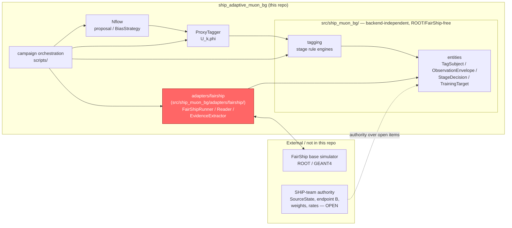
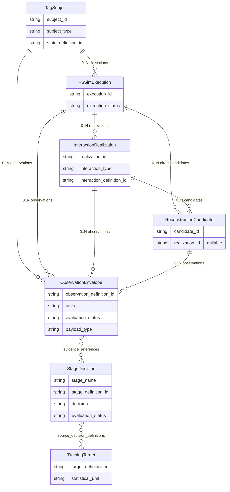
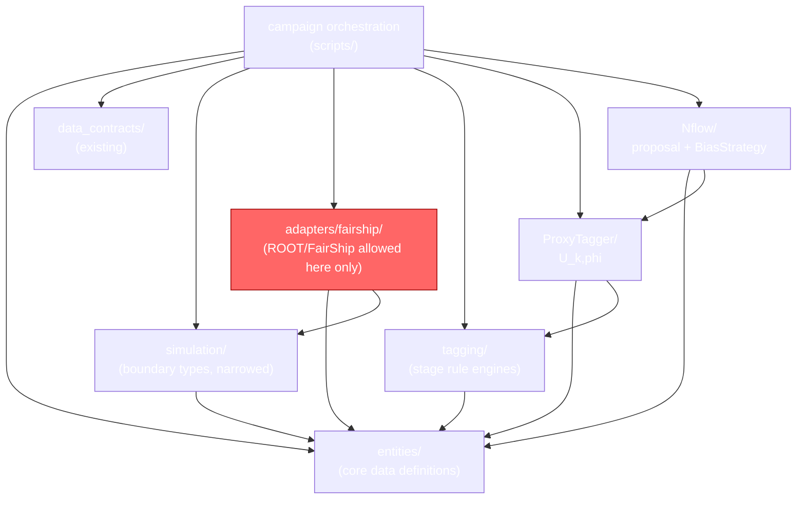
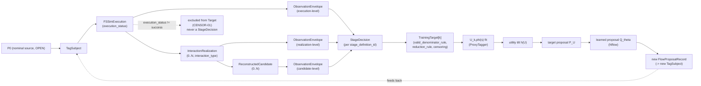
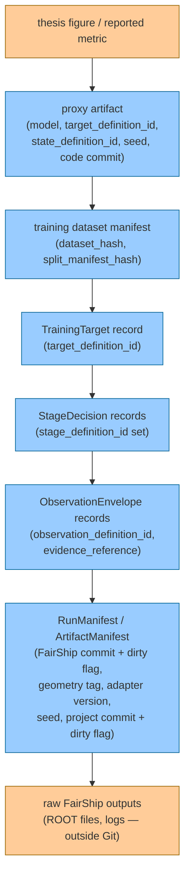

# Scientific Architecture v2 — evidence, tags, targets, proxy, proposal

Status: **specification only** for everything except
`src/ship_muon_bg/entities/` and the generic `src/ship_muon_bg/tagging/` core,
which are implemented and tested as additive slices (see §11). This document
is the implementable software architecture implied by
`docs/contracts/tagging_contract_v0.md` (the "contract"). Where this
document and the contract disagree, the contract wins; file the disagreement
as a new `OPEN-*` item rather than resolving it here.

Inspected repository SHA: `aca59a45d5fb9aad6629f3b7834f7e734092814d`
(branch `feat/adapter`). This document complements, and does not replace,
`docs/architecture/repo_architecture_v1.md` (the current three-module
layout) and `docs/contracts/fairship_adapter_contract_v0.md` (the FairShip
boundary contract it refines).

**Revision note (second continuation, supersedes the first gauntlet round's
placement fix — see §2a):** the first gauntlet round moved the FairShip
adapter to a top-level `fairship_adapter/` package because the then-existing
guard test `tests/test_data_contracts.py::test_no_root_or_fairship_import_in_core`
swept the entire `src/ship_muon_bg` tree with no exemption. That test has
since been **retired** (not skipped — deleted) and replaced with
`tests/test_architecture_boundaries.py`, which enforces the narrower,
correct invariant: *backend-independent* packages must stay ROOT/FairShip-free;
the FairShip adapter itself is an explicitly sanctioned exception at
`src/ship_muon_bg/adapters/fairship/`. This is an explicit **PROJECT
DECISION** by the repository owner (not a scientific claim, so it does not
need external evidence to resolve) that supersedes the prior round's
placement choice. §2a records why the new test makes this safe.

## 1. System context



`SHIP` is drawn only to show that several `core` decisions remain externally
gated (`OPEN-01`, `OPEN-02`, `OPEN-05`, `OPEN-06` in the contract); this repo
does not model SHiP-team process. `ADAPTER` (red) is drawn *inside*
`src/ship_muon_bg/` but *outside* the `core_scope` subgraph — it is a
sibling subpackage under the same top-level `ship_muon_bg` namespace, not a
separate top-level package, and not covered by the backend-independence
guard (§2a).

## 2. Package / module boundaries and responsibilities

| Package | Status | Responsibility | May import |
| --- | --- | --- | --- |
| `src/ship_muon_bg/entities/` | **implemented** (§11) | Canonical dataclasses/schemas: `TagSubject`, `FSSimExecution`, `InteractionRealization`, `ReconstructedCandidate`, `ObservationEnvelope` (+ typed payloads), `StageDecision`, content-addressed `definition_id` helper. `TrainingTarget`/`RunManifest`/`ArtifactManifest` remain specification-only (next slice). Pure Python + NumPy-optional. No behavior beyond validation invariants (`__post_init__` checks). | nothing project-specific |
| `src/ship_muon_bg/data_contracts/` | existing [VERIFIED] | Raw `(N, 8)` PKL ingestion, hashing, splits, normalization. Unchanged by this document. | nothing project-specific |
| `src/ship_muon_bg/simulation/` | existing, **narrowed** | `SimulationBackend` protocol; `FlowProposalRecord`/`SimulationResult`/`OutcomeCategory` retained as a **derived, single-stage/single-realization convenience view** over `entities/` (§9 migration), not the canonical lineage representation. | `entities/` |
| `src/ship_muon_bg/adapters/fairship/` (subpackage of `src/ship_muon_bg/`; **not** a new top-level package) | **new**, not implemented | Translates FairShip-specific representations into `entities/` records. Internally split into `FairShipRunner` (invokes the backend), `FairShipReader` (reads raw outputs), `FairShipEvidenceExtractor` (produces `ObservationEnvelope`s), `FairShipAdapterCapabilities` (declares what this adapter version can extract). The *only* place ROOT/FairShip/CERN-EOS knowledge is allowed, and the *only* subtree of `src/ship_muon_bg/` exempt from the backend-independence guard (§2a). | `entities/`, `simulation/`, ROOT/FairShip |
| `src/ship_muon_bg/tagging/` | **implemented (this slice)** | Backend-independent declarative `StageDefinition` plus `StageEvaluator`, ending at `StageDecision`; includes one explicitly non-physical scalar fixture. No `TrainingTarget` or physical SHiP tag is defined. | `entities/` only |
| `ProxyTagger/` (future migration target: `src/ship_muon_bg/proxy/`, not performed in this task) | existing [VERIFIED], **narrowed** | `U_{k,phi}(s)` models: `fit`/`score` over NumPy arrays whose labels came from `tagging/`'s `TrainingTarget` output. | `entities/`, `tagging/` (label construction only, not rule engines) |
| `Nflow/` (future migration target: `src/ship_muon_bg/proposal/`, not performed in this task) | existing [VERIFIED] | Proposal models + `BiasStrategy`. Unchanged interfaces; documentation-only update to say a `BiasStrategy` consumes `U_{k,phi}(s)` for one explicit `k`. | `entities/`, `ProxyTagger/` |
| campaign orchestration (`scripts/` today; future migration target `src/ship_muon_bg/evaluation/`) | existing (thin scripts) [VERIFIED] | Wires adapter → tagging → proxy → proposal for one campaign run; writes `RunManifest`. Only layer allowed to import everything below it, including `adapters/fairship/`. | everything |

The target tree, with the generic tagging core now present and the remaining
layers still future work, is:

```text
src/ship_muon_bg/
    entities/          # implemented (this slice)
    data_contracts/     # existing
    simulation/          # existing, narrowed (legacy convenience view)
    adapters/
        fairship/        # not implemented — the only ROOT/FairShip-allowed subtree
    tagging/             # implemented generic core; no physical tags
    proxy/               # future migration from ProxyTagger/, not in this task
    proposal/            # future migration from Nflow/, not in this task
    evaluation/          # future migration from scripts/, not in this task
```

### 2a. Dependency invariant: direction, not directory depth

**[PROJECT DECISION]** Package *placement* under `src/ship_muon_bg/` does not
by itself determine what may import ROOT/FairShip; the *dependency
direction* does. The invariant is:

Allowed:

```text
adapters/fairship  -> entities/
adapters/fairship  -> ROOT / FairShip

tagging            -> entities/
proxy              -> entities/
proxy              -> tagging (contracts/data, not rule-engine internals)
proposal           -> entities/
proposal           -> proxy (interfaces only)
```

Forbidden:

```text
entities/  -> adapters/fairship
entities/  -> ROOT / FairShip

tagging    -> adapters/fairship
tagging    -> ROOT / FairShip

proxy      -> adapters/fairship
proxy      -> ROOT / FairShip

proposal   -> adapters/fairship
proposal   -> ROOT / FairShip
```

Campaign orchestration/evaluation may depend on both scientific layers and
`adapters/fairship`, because wiring dependencies together is its purpose.

This is enforced by `tests/test_architecture_boundaries.py`
(**implemented**, replacing the retired
`tests/test_data_contracts.py::test_no_root_or_fairship_import_in_core`),
which:

- sweeps only a declared list of **backend-independent package roots**
  (today: `entities/`, `data_contracts/`, `simulation/`, `tagging/`; extended
  as `proxy/`/`proposal/` land) for any ROOT/FairShip import,
  using AST-based dotted-import-name inspection rather than whole-line
  substring matching (more precise: a segment must equal `"root"` or start
  with `"fairship"`, not merely contain that text anywhere on the line);
- **never** includes `adapters/` in that swept list — exemption comes from
  root selection, not from the scanner special-casing that path, verified
  by a synthetic-fixture test that points the same scanner directly at a
  fake `adapters/fairship/` subtree and confirms it *does* flag ROOT/FairShip
  imports there, proving the scanner itself is not blind to them;
- separately rejects any `ship_muon_bg.adapters.fairship` import appearing
  inside a backend-independent package (the reverse-dependency case) — the
  same AST scanner catches this because the forbidden-segment check matches
  on `"fairship"` regardless of which dotted path it appears in, so
  `from ship_muon_bg.adapters.fairship import FairShipRunner` is caught by
  the identical mechanism that catches `import ROOT`.
- does not require ROOT or a real FairShip checkout to run.

### Prohibited imports

- `entities/`, `tagging/`, `ProxyTagger/`, `Nflow/` must **never** import ROOT,
  FairShip, or `ship_muon_bg.adapters.fairship` (§2a).
- `tagging/` must **never** import `adapters/fairship/` directly. Tagging
  consumes `entities/`-typed records regardless of which backend (toy, fake,
  or real FairShip) produced them; coupling tagging to the adapter package
  would leak backend-specific assumptions upstream (exactly the risk
  `DECISION-05` documents today).
- `ProxyTagger/` and `Nflow/` must never import `adapters/fairship/`.
- Only campaign orchestration may import `adapters/fairship/` and,
  transitively through it, ROOT/FairShip.

## 3. Entity / cardinality lineage



No edge above is cardinality-1 on the "many" side; this is the direct fix for
`EXEC-02`'s evidence (today's scalar `SimulationResult.dis` field).
`InteractionRealization` (not `DISRealization`) is the corrected,
interaction-neutral name resolving `OPEN-09` (§9a); `interaction_type =
"muon_dis"` is how current Muon DIS is represented, not a hardcoded entity
name. `ObservationEnvelope` (not bare `Observation`) reflects the two-level
typed-payload design in §7a.

## 4. Dependency graph



Only `adapter` (red) and `orch` (transitively, only to invoke `adapter`) may
touch ROOT/FairShip. This realizes the GOAL's requested chain "core/data
definitions ← FairShip adapter ← tagging ← proxy ← proposal/evaluation" as a
**layering order**, with one deliberate refinement: `tagging`, `proxy`, and
`nflow` depend on `entities` directly, not on `adapter` — the FairShip
adapter and the tagging layer are siblings over `entities`, not a chain of
direct imports. A direct `tagging -> adapter` import would force ROOT
transitively into tagging's import graph the moment `adapter` gains a
top-level `import ROOT`, defeating the isolation goal even if `tagging`
itself never calls into ROOT. Conceptually, data still flows
adapter-output → tagging-input; only the *Python import edge* is redirected
through `entities`.

## 5. Evidence → tag → target → proxy → proposal flow



The `Excluded` branch is drawn explicitly because it is the one path the
contract forbids merging back into `Decide`/`Target` (`CENSOR-01`).

## 6. Artifact / provenance lineage



Blue nodes are schema/manifest/hash records small enough for Git (or a Git-
adjacent artifact store); orange nodes are large or presentation artifacts
that stay out of Git per `README.md`'s existing "Keep large datasets out of
Git" rule [VERIFIED] and `PROV-03`.

## 7. Stable interfaces

`entities/` below is **implemented** (`src/ship_muon_bg/entities/`, this
slice — signatures shown match the real code, not a sketch). The generic
tagging core is also implemented in `src/ship_muon_bg/tagging/` (§7b).
Everything after `entities/target.py` remains illustrative only, to prove the
remaining contract is implementable; `TrainingTarget` and the FairShip
adapter are not implemented in this commit (scope control).

```python
# entities/subject.py — implemented
@dataclass(frozen=True)
class TagSubject:
    subject_id: str
    subject_type: str
    state_definition_id: str

# entities/lineage.py — implemented
class ExecutionStatus(str, enum.Enum):
    SUCCEEDED = "succeeded"
    TECHNICAL_FAILURE = "technical_failure"
    # health only — never accepted_candidate/physics_rejection (EXEC-03)

@dataclass(frozen=True)
class FSSimExecution:
    execution_id: str
    subject_id: str
    fs_sim_configuration_id: str
    execution_status: ExecutionStatus

@dataclass(frozen=True)
class InteractionRealization:      # not DISRealization — see §9a
    realization_id: str
    execution_id: str
    interaction_type: str          # e.g. "muon_dis"
    interaction_definition_id: str

@dataclass(frozen=True)
class ReconstructedCandidate:
    candidate_id: str
    execution_id: str
    realization_id: Optional[str] = None  # None = execution-level, not forced 1:1

# entities/observation.py — implemented (two-level envelope + typed payload, see §7a)
class ObservationEvaluationStatus(str, enum.Enum):
    COMPUTED = "computed"
    NOT_APPLICABLE = "not_applicable"
    TECHNICALLY_UNAVAILABLE = "technically_unavailable"

class ObservationPayload:          # marker base; concrete payloads subclass it
    __slots__ = ()

@dataclass(frozen=True)
class ScalarObservationPayload(ObservationPayload):
    value: float

@dataclass(frozen=True)
class SequenceObservationPayload(ObservationPayload):
    values: Tuple[float, ...]

@dataclass(frozen=True)
class ObservationEnvelope:
    observation_id: str
    subject_ref: str               # subject_id / execution_id / realization_id / candidate_id
    observation_definition_id: str
    units: str
    evaluation_status: ObservationEvaluationStatus
    evidence_reference: str
    payload: Optional[ObservationPayload]  # None unless evaluation_status is COMPUTED
    config_provenance: Mapping[str, str] = field(default_factory=dict)

# entities/decision.py — implemented
class DecisionEvaluationStatus(str, enum.Enum):
    EVALUATED = "evaluated"
    NOT_EVALUATED = "not_evaluated"
    TECHNICALLY_UNAVAILABLE = "technically_unavailable"

@dataclass(frozen=True)
class StageDecision:
    decision_id: str
    subject_ref: str
    stage_definition_id: str
    evaluation_status: DecisionEvaluationStatus
    decision: Optional[Any]        # None unless evaluation_status is EVALUATED
    reason: str = ""
    evidence_references: Tuple[str, ...] = ()
    config_provenance: Mapping[str, str] = field(default_factory=dict)

# entities/identifiers.py — implemented
def definition_id(label: str, content: Mapping[str, Any]) -> str:
    """Content-addressed: "{label}@sha256:{hexdigest(canonical_json(content))}"."""

# entities/target.py — NOT implemented this slice (next slice, deliberately deferred)
@dataclass(frozen=True)
class TrainingTarget:
    target_definition_id: str
    state_definition_id: str
    source_decision_definitions: Tuple[str, ...]
    valid_denominator_rule: str    # reference to a versioned rule, not inline code
    reduction_rule: str
    missingness_rule: str
    compatible_configuration_set: Tuple[str, ...]
    statistical_unit: str          # "subject" | "execution" | "realization" | "candidate"

# adapters/fairship/capabilities.py — NOT implemented (path corrected, §2a)
@dataclass(frozen=True)
class FairShipAdapterCapabilities:
    adapter_version: str
    supports_multi_realization: bool
    supports_reconstruction: bool
    geometry_tags_supported: Tuple[str, ...]
    observation_definitions_supported: Tuple[str, ...]
```

`FairShipAdapterCapabilities` lets `tagging/` decide, per stage, whether an
`ObservationEnvelope` should even be attempted (`evaluation_status =
NOT_APPLICABLE`) versus attempted-and-failed (`TECHNICALLY_UNAVAILABLE`) —
capability discovery, not a runtime exception, is how an older adapter
degrades against a stage definition written for a newer one.

### 7a. Typed-observation design rationale

**[PROJECT DECISION, resolved this continuation.]** Two designs were
considered for `ObservationEnvelope.payload`:

1. An unrestricted EAV (entity-attribute-value) system — every observation
   is just `(name, value, units)`. Rejected: it makes a path-length sequence,
   a per-volume traversal map, or a future structured reconstruction record
   indistinguishable from a scalar at the type level, silently pushing
   flattening decisions onto every consumer (exactly what `OBS-02` forbids).
2. A **two-level design**: `ObservationEnvelope` carries all
   provenance/status metadata common to every observation
   (`observation_definition_id`, `units`, `evaluation_status`,
   `evidence_reference`, `config_provenance`), wrapping a typed `payload:
   ObservationPayload`. Concrete payload types are plain frozen dataclasses
   inheriting from the `ObservationPayload` marker — no registry, no plugin
   discovery, no dynamic dispatch, so `isinstance(payload, ObservationPayload)`
   is a real, meaningful runtime check.

**Chosen: (2).** This slice implements exactly two payload shapes —
`ScalarObservationPayload` (one float) and `SequenceObservationPayload` (an
ordered float tuple) — to *prove* both scalar and non-scalar payloads are
supported without flattening, not to enumerate the eventual taxonomy. Future
payload types named in the GOAL (`TransportStateObservation`,
`MaterialTraversalObservation`, `PathObservation`, `InteractionObservation`,
`ReconstructionObservation`) are additional `ObservationPayload` subclasses
added when their first real consumer needs them — each is a small, additive
change, never a redesign of `ObservationEnvelope` itself. `ObservationEnvelope.__post_init__`
enforces `OBS-03`/`CENSOR-02` structurally: a `COMPUTED` envelope must carry
a payload; `NOT_APPLICABLE`/`TECHNICALLY_UNAVAILABLE` must carry `None` —
never a sentinel value written into the payload slot.

### 7b. Generic tagging core — implemented this slice

`StageDefinition` stores recursively immutable declarative semantic content,
the required `observation_definition_id` set in deterministic exact-string
sorted order, and a content-addressed `stage_definition_id` produced by
`entities.definition_id`. The generic dependency set is unordered; duplicate
IDs remain invalid. Explicitly role-coded fields in `semantic_content` retain
their own order-sensitive semantics. `StageEvaluator`
accepts one `StageDefinition`, an `ObservationEnvelope` collection, and one
declared `subject_ref`; it returns one `StageDecision` and never aggregates
across entity references. v0 supports only the controlled
`fixture.scalar_above_threshold` rule (`value > threshold`), which is marked
non-physical and is not a SHiP selection, veto, DIS, or proxy target.

For mixed required-evidence availability, the deterministic precedence is
`TECHNICALLY_UNAVAILABLE` > `NOT_APPLICABLE` > missing. The first produces a
`TECHNICALLY_UNAVAILABLE` `StageDecision`; either of the latter two produces
`NOT_EVALUATED`. All unevaluable paths carry `decision = None`, and produced
decisions retain the consumed `ObservationEnvelope.observation_id` values in
`evidence_references` without copying payloads.

`decision_id` is content-addressed with the stage definition, subject
reference, canonical consumed evidence identities, and evaluation status. The
decision result itself is not redundantly hashed because the current
declarative evaluator derives it from those semantic inputs; the censoring
reason is likewise derived context. Thus repeated evaluation of equivalent
inputs is stable, while distinct evidence realizations cannot silently share
the same decision identity. This is deterministic evaluation identity, not a
final raw-artifact provenance or run-manifest system; those remain future
work.

## 8. Adapter versioning and capability discovery

- `adapters/fairship/` carries its own `adapter_version`, independent of the
  project's `git_commit` (mirrors `PROV-02`'s existing precedent of keeping
  `backend_version` separate from `git_commit` in
  `fairship_adapter_contract_v0.md`).
- Every `RunManifest` records `adapter_version` and the `FairShipAdapterCapabilities`
  snapshot active at run time (not just the version string), so a later
  `tagging/` re-read of old evidence can tell *why* an `ObservationEnvelope`
  is `TECHNICALLY_UNAVAILABLE` for that run without re-deriving it from the
  version number alone.
- No plugin auto-discovery / import scanning. Adapter selection is an
  explicit dict-of-factories registry, following the existing, already-
  tested pattern in `Nflow/registry.py` (`create_density_estimator`,
  [VERIFIED]) rather than entry-point scanning — same rationale: "no
  decorators, no plugin discovery, no import scanning" keeps the import
  graph auditable.

## 9. Migration analysis (v1 objects → v2)

Per-object classification, as required. "Minimal migration sequence" lists
are additive-first per the GOAL's instruction to prefer additive over
destructive migration; nothing below is executed in this commit except the
`entities/` package itself (§11).

### 9a. `OPEN-09` resolved: `DISRealization` → `InteractionRealization`

**[PROJECT DECISION, closes `OPEN-09` this continuation.]** The first
gauntlet round flagged (as `OPEN-09`) that `DISRealization`'s name baked a
DIS-specific assumption into a structurally privileged lineage entity, even
though its fields were already interaction-type-agnostic. Resolved:
the entity is renamed `InteractionRealization` and gains two fields,
`interaction_type` (e.g. `"muon_dis"`) and `interaction_definition_id` (the
versioned rule that classified it as that type). Current Muon DIS is
represented as `interaction_type = "muon_dis"`, not as the entity's
identity. No final interaction taxonomy is invented — `interaction_type` is
an open string, not a closed enum, precisely so a future non-DIS
interaction type does not require a new parallel entity or a second rename.
A DIS-specific typed view/specialization may be layered on top later if a
concrete consumer needs one; the base entity stays neutral. This is
implemented (`src/ship_muon_bg/entities/lineage.py::InteractionRealization`,
§11) and closes `OPEN-09` in `docs/contracts/tagging_contract_v0.md`.

### `FlowProposalRecord` — **KEEP**

- **Current role**: candidate proposal crossing into a `simulation_backend`
  (`types.py:32-53` [VERIFIED]).
- **Semantic risk**: low. It represents a proposal, not an outcome; none of
  the flagged conflations (execution/physics, 1:1 cardinality) apply to it.
- **v2 destination**: unchanged type; gains one additive helper,
  `to_tag_subject(record) -> TagSubject`, so orchestration can mint a
  `TagSubject` from a proposal without changing the dataclass.
- **Backward compatibility**: no change to the existing type or its tests.
- **Minimal migration**: add the helper function in a new module; no edits
  to `types.py`.

### `SimulationResult` — **DEPRECATE GRADUALLY**

- **Current role**: single flat record combining outcome category, a scalar
  `dis` tag, free-text `detail`, and free-form `metadata`
  (`types.py:56-80` [VERIFIED]).
- **Semantic risk**: **high**, and confirmed by evidence (`DECISION-05`,
  `EXEC-02`): one object conflates execution health with one hardcoded
  stage decision, and has no room for `0..N` realizations or candidates.
- **v2 destination**: superseded by `FSSimExecution` + `InteractionRealization` +
  `StageDecision` (§3, §7). `SimulationResult` becomes an optional, clearly-
  labeled **derived projection** (`simulation_result_from_lineage(execution,
  decisions) -> SimulationResult`) for any caller that only needs a legacy
  flat view and accepts its 1:1 simplification. Per `COMPAT-06`
  (tightened during gauntlet review), this projection **must** write the
  exact `stage_definition_id` it was derived under into
  `SimulationResult.metadata` (an existing `Mapping[str, str]` field,
  `types.py:74` [VERIFIED], so this is a zero-schema-change requirement);
  two projections with different embedded `stage_definition_id` values must
  never be pooled or compared, closing the reintroduced-silent-pooling gap
  a plain 1:1 projection would otherwise create.
- **Backward compatibility**: keep the dataclass and its existing tests
  (`tests/test_architecture.py::test_technical_failure_never_carries_a_dis_tag`
  etc. [VERIFIED]) green and unchanged; they continue to describe a valid
  (if narrowed) projection.
- **Minimal migration sequence**: (1) land `entities/` types with no
  consumer yet; (2) implement the `toy_simulator` (existing roadmap step 2,
  `repo_architecture_v1.md` [VERIFIED]) to emit lineage objects *and* the
  derived `SimulationResult` projection side by side; (3) migrate
  `ProxyTagger` label construction onto `TrainingTarget` output; (4) only
  once no consumer reads `SimulationResult` for training, mark it
  deprecated in its docstring — do not delete it while
  `fairship_adapter_contract_v0.md` still cites it as the adapter's output
  type, since that contract's own text would need a coordinated update.

### `OutcomeCategory` — **DEPRECATE GRADUALLY**

- **Current role**: the exact 3-way enum
  `technical_failure`/`physics_rejection`/`accepted_candidate`
  (`types.py:18-29` [VERIFIED]).
- **Semantic risk**: high — this is the concrete evidence for
  `DECISION-05`'s conflation finding; it hardcodes "the" selection stage as
  if it were the only stage that will ever exist.
- **v2 destination**: split into (a) an `ExecutionStatus` enum in
  `entities/` carrying only `TECHNICAL_FAILURE`-equivalent health states,
  and (b) per-`stage_definition_id` decision vocabularies defined by
  `tagging/`, not one global enum. `physics_rejection`/`accepted_candidate`
  become the decision values of *one specific* stage definition, working
  name `"operational_selection_v0"` — per `CONF-01`/`CLAIM-NO-10`, this label
  is a provisional display name only until it is paired with a recorded
  content hash of the selection rule it names; the label alone is not a
  compliant `stage_definition_id` — not the only stage that can exist.
- **Backward compatibility**: `OutcomeCategory` keeps its three values and
  keeps gating `SimulationResult`'s derived projection (above); new stage
  definitions in `tagging/` do not touch it.
- **Minimal migration sequence**: introduce `ExecutionStatus` and the first
  named `stage_definition_id` alongside `OutcomeCategory` (additive); only
  after a second real stage definition exists (e.g. a veto stage) does
  `OutcomeCategory`'s single-enum shape become actively misleading enough to
  formally deprecate in docs.

### `SimulationBackend` — **KEEP + NARROW**

- **Current role**: `Protocol` with one method, `simulate(...) ->
  List[SimulationResult]` (`backend.py:16-38` [VERIFIED]).
- **Semantic risk**: low as a *protocol* — it is easy to extend without
  breaking callers, since Python protocols are structurally checked.
- **v2 destination**: keep `simulate()` returning `List[SimulationResult]`
  for the toy/legacy path; add a second, optional protocol member,
  `simulate_with_lineage(...) -> List[FSSimExecution]` (executions carrying
  their own realizations/candidates), which `adapters/fairship/` implements
  and `tagging` consumes. A backend may implement one or both.
- **Backward compatibility**: fully additive; existing `toy_simulator`
  (once built) keeps working against `simulate()` alone.
- **Minimal migration**: add the second protocol method's signature to
  `backend.py`'s docstring as "future"; do not require any current
  implementer (there are none yet — `toy_simulator` is unbuilt) to provide
  it until `adapters/fairship/` exists.

### `ProxyScorer` (`ProxyTagger/interfaces.py`) — **KEEP + NARROW**

- **Current role**: `fit(x, labels)`/`score(x) -> U(x)` protocol plus a
  score-artifact schema (`SCORE_ARTIFACT_FIELDS`, `interfaces.py:1-77`
  [VERIFIED]).
- **Semantic risk**: medium — the *protocol signature* (NumPy arrays in/out)
  is fine and reusable; the *artifact schema* has no `target_definition_id`,
  so two proxies trained against different targets are indistinguishable by
  artifact alone.
- **v2 destination**: keep `fit`/`score` unchanged. Extend
  `SCORE_ARTIFACT_FIELDS` additively with `target_definition_id`,
  `state_definition_id`, and `calibration_definition_id` (nullable), under a
  new `SCORE_SCHEMA_VERSION` — this versioning mechanism already exists
  (`interfaces.py:31` [VERIFIED]) specifically to absorb this kind of
  change.
- **Backward compatibility**: `DummyProxy` keeps `is_physical = False` and
  needs no `target_definition_id` (it is documented as non-physical and
  never trained); existing tests
  (`tests/test_architecture.py::test_dummy_proxy_scores_fixture` [VERIFIED])
  are unaffected since they never construct a real score artifact.
- **Minimal migration**: bump `SCORE_SCHEMA_VERSION`, add the fields with
  `Optional`/default values so `DummyProxy`'s existing usage compiles
  unchanged; require the new fields only for artifacts whose `is_physical`
  is `True`.

### `ProxyTagger/` (package) — **KEEP + NARROW**

- **Current role**: houses the `U(x)` interface and the `DummyProxy`
  placeholder only; no trained proxy exists (`ProxyTagger/README.md`
  [VERIFIED]).
- **Semantic risk**: low today (nothing physical is implemented yet); the
  risk is in what gets built next without this architecture.
- **v2 destination**: unchanged package location; its future real-proxy
  training code depends on `tagging/`'s `TrainingTarget` output instead of
  hand-filtering `OutcomeCategory` itself, so `CENSOR-01` is enforced once,
  centrally, in `tagging/`, not re-implemented per proxy.
- **Backward compatibility**: no current code changes; this only constrains
  *future* PRs (explicitly out of scope to write now).
- **Minimal migration**: none required now; recorded as a design constraint
  for the first real `ProxyScorer` PR (roadmap step 4,
  `repo_architecture_v1.md` [VERIFIED]).

### `Nflow/` (package) — **KEEP**

- **Current role**: `DensityModel`/`DensityEstimator`/`BiasStrategy`
  protocols plus tested Gaussian/GMM/affine-coupling estimators
  (`Nflow/interfaces.py`, `Nflow/registry.py` [VERIFIED]).
- **Semantic risk**: low. `BiasStrategy` already treats `U(x)` scores as an
  opaque `np.ndarray` input (`interfaces.py:161` [VERIFIED]) — it has no
  hardcoded assumption about what `U(x)` means, so parameterizing it by an
  explicit `k` is a documentation change, not a code change.
- **v2 destination**: unchanged interfaces. Documentation update only: note
  that `scores` in `BiasStrategy.resample`/`loss_weights` are
  `U_{k,phi}(s)` for one explicit, recorded `target_definition_id = k`.
- **Backward compatibility**: fully preserved; no code touched.
- **Minimal migration**: a doc-only PR to `Nflow/README.md` and
  `Nflow/interfaces.py`'s docstring, out of scope for this task (`Nflow`
  migration is explicitly excluded by SCOPE CONTROL).

## 10. Test strategy

Four levels, each protecting a different failure class, plus a boundary
level enforcing §2a's dependency invariant specifically.

0. **Boundary/architecture tests** — protect the dependency invariant
   itself (§2a), independent of any entity semantics. **Implemented**:
   `tests/test_architecture_boundaries.py` — AST-based purity sweep over
   declared backend-independent package roots, reverse-dependency rejection
   of `ship_muon_bg.adapters.fairship` imports, and synthetic-fixture proof
   that the scanner is not blind to ROOT/FairShip imports in general (it
   only excludes `adapters/` by root selection, not by special-casing).
   Replaces the retired `tests/test_data_contracts.py::test_no_root_or_fairship_import_in_core`.
1. **Unit tests** — protect individual dataclass invariants. **Implemented**:
   `tests/test_entities.py` — `TagSubject` immutability,
   `StageDecision.__post_init__` rejecting a `decision` when
   `evaluation_status != EVALUATED` (and rejecting a smuggled `False` under
   `NOT_EVALUATED`/`TECHNICALLY_UNAVAILABLE`), `ObservationEnvelope`
   rejecting a payload when `evaluation_status != COMPUTED`, cardinality
   non-collapse (one subject → many executions → many realizations,
   optional realization association on candidates),
   `ExecutionStatus`'s value set excluding physics-decision values, and
   `definition_id` determinism/content-sensitivity. Extends the existing
   pattern in `tests/test_architecture.py` (e.g.
   `test_technical_failure_never_carries_a_dis_tag` [VERIFIED]).
   `tests/test_tagging.py` additionally protects declarative stage identity,
   scoped evaluation, evidence references, and missingness precedence.
2. **Contract tests** — protect the *shape* of the boundary independent of
   backend: any object satisfying `SimulationBackend` (toy, fake, or a real
   `adapters/fairship/`) must produce `entities/`-valid records; artifact
   manifests validate against their schema. Directly extends
   `fairship_adapter_contract_v0.md`'s existing "Testing expectations before
   implementation" list [VERIFIED] (dry-run contract test, schema
   validation, fake-backend roundtrip) to the new `entities/`/`tagging/`
   types. Not implemented this slice (no adapter or full
   `TrainingTarget`/physical-tag path yet; the generic tagging core is
   implemented).
3. **Integration tests** — protect end-to-end plumbing through a toy/fake
   backend: proposal → adapter stub → `tagging` → `TrainingTarget`
   construction → `ProxyTagger.fit`/`score` → `BiasStrategy`, with no ROOT.
   Catches boundary-wiring bugs (e.g. an execution's `0..N` realizations
   silently truncated to 1 somewhere in the wiring). Not implemented this
   slice.
4. **Scientific regression tests** — protect *semantic invariants*, not
   floating-point equality, using fixed fixtures:
   - lineage preservation (every `ReconstructedCandidate` still traces to
     its `InteractionRealization`/`FSSimExecution`/`TagSubject`);
   - state identity (`state_definition_id` unchanged for unchanged coordinate
     semantics);
   - valid cardinality (no silent collapse of `0..N` to exactly 1);
   - technical censoring (`CENSOR-01` holds: no `TrainingTarget` denominator
     contains a subject whose relevant `execution_status` was not a success
     state);
   - expected stage availability (`FairShipAdapterCapabilities` accurately
     predicts which `ObservationEnvelope`s a given adapter version can
     produce);
   - stable observation semantics within tolerance (a fixed toy backend's
     `ObservationEnvelope` values do not silently drift run to run for the
     same seed);
   - candidate multiplicity preservation (a fixture execution with N > 1
     realizations still has N realizations after passing through `tagging`).
   Not implemented this slice (no toy backend, no `TrainingTarget` yet).

   A changed invariant must fail the test or force a new `*_definition_id`;
   golden fixtures are never silently regenerated to match new output
   (extends the existing determinism requirement already stated in
   `fairship_adapter_contract_v0.md`'s "Deterministic toy campaign" test
   [VERIFIED]).

## 11. Migration path from v1

Additive, incremental, in this order. **Steps 1, 2 and 3 are done**; steps 4-5
are not executed yet.

1. **[DONE]** Add `src/ship_muon_bg/entities/` with no consumers; unit-test
   its invariants in isolation (`tests/test_entities.py` plus
   `tests/test_architecture_boundaries.py`, 30 focused tests, all passing).
   At that point, zero risk to existing code was preserved: only the package
   export and test files were changed. `TrainingTarget` was deliberately
   deferred to a later slice.
2. **[DONE]** Add the backend-independent `tagging/` core with declarative
   `StageDefinition`, content-addressed semantic identity, scoped
   `StageEvaluator`, explicit missingness precedence, evidence references,
   and the non-physical `fixture.scalar_above_threshold` stage. This does not
   define or reproduce any physical `OutcomeCategory` selection semantics.
3. **[DONE, adapted]** Add the canonical evaluation boundary
   (`simulation/evaluation.py`: `EvaluationRequest`, `EvaluationBundle`,
   `EvaluationBackend`) plus two backends emitting the new lineage objects
   (`simulation/fake_fairship.py`, `simulation/stub_backend.py`) and the
   state-level aggregation that consumes them (`tagging/aggregation.py`).
   See `docs/architecture/fairship_evaluation_adapter_v1.md`.

   Adapted in one respect: the backends emit lineage objects **only**, not a
   parallel legacy `SimulationResult` projection. That projection turned out
   to be unnecessary rather than deferred — no production code consumes
   `SimulationResult`; the legacy types are referenced only by
   `tests/test_architecture.py` and a `ProxyTagger/interfaces.py` docstring —
   so emitting a second, lossier view of the same run would have created a
   second source of truth for no consumer. The legacy types remain untouched
   and working; if a projection is ever needed it is a pure function over the
   lineage records, derivable after the fact.
4. Migrate `ProxyTagger`'s (still-hypothetical) first real training code to
   read `TrainingTarget` output instead of filtering `OutcomeCategory`
   directly.
5. Only then, begin the `adapters/fairship/` dry-run track (existing
   roadmap step 3a), now able to target `entities/`/`tagging/` directly
   instead of the flat `SimulationResult`.

Each step is independently testable and independently revertable; no step
requires deleting or rewriting a prior step's output.

## 12. Extraction boundary (FairShip adapter as a future separate repo)

`adapters/fairship/` living inside `src/ship_muon_bg/` (§2a) does not close
off a future extraction; it changes what that extraction looks like
slightly. If `adapters/fairship/` is later pulled into its own repository:

- The only things that must cross the boundary are `entities/`'s dataclasses
  and `simulation/`'s `SimulationBackend` protocol — both already NumPy-only
  with zero heavy dependencies (extends the existing "core stays NumPy-only"
  rule, `pyproject.toml:11-15` [VERIFIED]).
- `entities/` should therefore be published (or at least versioned) as a
  standalone-installable unit. Because `adapters/fairship/` is a subpackage
  of `src/ship_muon_bg` (not a separate top-level package), extracting it
  means splitting a subpackage *out of* the existing `src/ship_muon_bg`
  wheel entry (`pyproject.toml`'s `[tool.hatch.build.targets.wheel]`
  `packages` list is exactly `["src/ship_muon_bg", "Nflow", "ProxyTagger"]`
  today [VERIFIED]) — a marginally bigger lift than moving an
  already-top-level package would have been, since it requires a package
  split rather than a pure directory move. This is an accepted trade-off of
  the explicit project decision in the revision note (top of this
  document): correct-by-construction dependency direction now, in exchange
  for a slightly larger (but still mechanical — no interface change) split
  if extraction is ever pursued later.
- The extracted adapter repo would depend on this repo's `entities`/`simulation`
  types (as a pinned dependency), and this repo's orchestration layer would
  depend on the adapter repo only through the existing `SimulationBackend`
  registry pattern (§8) — never a direct `import fairship_adapter_repo.*`
  scattered through orchestration code, so beyond the one-time package
  split, the extraction is a dependency-direction change only, not an
  interface change.
- `tagging/`, `ProxyTagger/`, `Nflow/` never import `adapters/fairship/`
  (§2), so none of them need to change at all if the adapter moves repos.

## 13. Deliberately unresolved

This document does not decide `OPEN-01` through `OPEN-08`, `OPEN-10`, or
`OPEN-11` in the contract (`OPEN-09` was resolved this continuation, §9a).
In particular, §1's `P0`/`SourceState` box and §5's flow diagram's leftmost
node are drawn as inputs, not as definitions — no diagram in this document
should be read as fixing what `P0` or endpoint `B` are.
